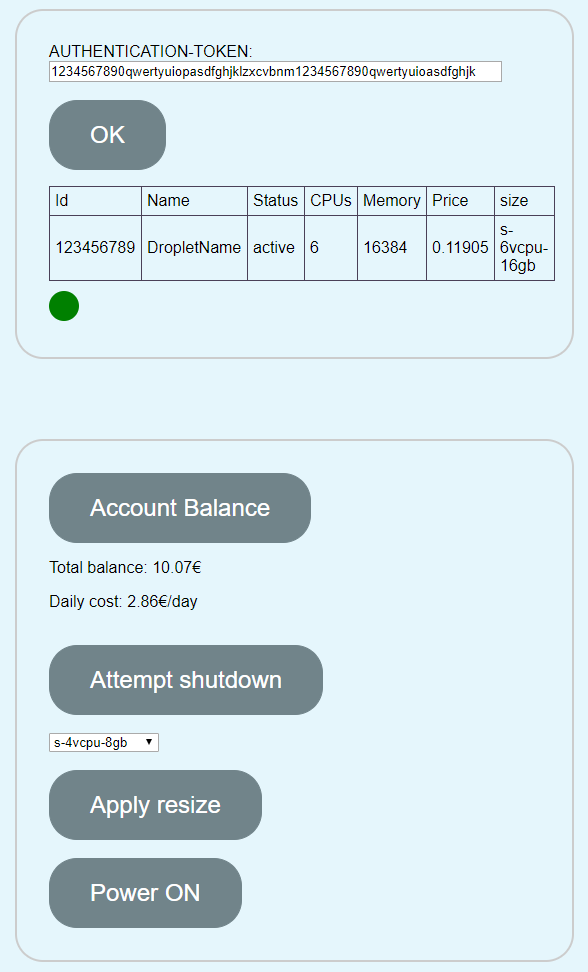

# Oceandashi

Small dasboard to control your digitalocean droplet(s).

## Usage

[Try it out here](https://eerovakiparta.github.io/Oceandashi/index.html)

##### Examples:

Checking server account balance

```
1. Enter your authentication token
2. Press OK
3. Account balance is displayed below and refreshed by Acoount balance button
```

Changing a server size to save money

```
# Note: steps for resizing and powering up the server take few minutes
1. Enter your authentication token
2. Press OK
3. Shut down server
4. Wait untill status is changed off / red
5. Select the size from drop down menu
6. Apply resize
7. Wait untill size has changed
8. Power ON the server
9. Server is up and running when status is back to Active / green
```



## End goal is:

- Save money by resizing server
- Check status
- stop & start

## TODOs:

- beautify
- allow multiple droplets
- add responsive features
- "One button resize" (shutdown,resize,powerup)

## WHY?

To enable people without account credentials to manipulate server.
